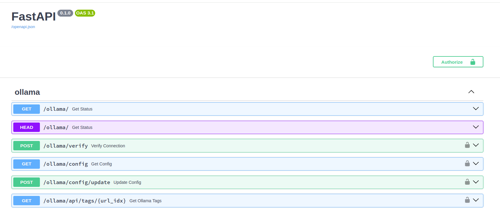

# OpenWebUI API Schema Exports

*Last updated: March 23, 2025*



## Overview

This repository provides an unofficial export of the OpenWebUI OpenAPI definitions, retrieved from the Swagger documentation. These exports are organized into structured JSON and Markdown files for easier reference and integration.

## Accessing OpenWebUI API Documentation

To access the API documentation on any OpenWebUI instance:

1. Enable the development environment by setting:
   ```
   ENV=dev
   ```

2. Navigate to `yourinstance.com/docs` to view the interactive Swagger documentation.

## Repository Contents

This repository contains:

- Raw schema exports from the OpenWebUI API documentation
- Categorized endpoint documentation organized by API section
- Both JSON and Markdown formats for different use cases

## File Organization

The repository is organized as follows:

```
220325/full-definition/by-api-endpoint/
├── audio/                  # API category directory
│   ├── json/               # JSON schema files
│   └── markdown/           # Markdown documentation files
├── auths/
│   ├── json/
│   └── markdown/
└── ... (other API categories)
```

Each API category directory contains:
- A `json` subdirectory with all JSON schema files
- A `markdown` subdirectory with all Markdown documentation files

## Using the Extract Script

The `scripts/extract.py` script can be used to generate fresh exports from an OpenAPI definition file:

```bash
# Place your OpenAPI JSON file as input.json in the root directory
# Then run:
python scripts/extract.py
```

The script will:
- Extract all paths with the prefix `/api/v1/`
- Generate separate JSON files for each endpoint
- Create Markdown documentation with details for each endpoint
- Organize outputs by API category (e.g., knowledge, chat, etc.)

## File Organization Script

The `scripts/organize_files.py` script organizes the exported files into separate JSON and Markdown subdirectories:

```bash
# Run the organization script:
python scripts/organize_files.py
```

This script:
- Creates `json` and `markdown` subdirectories within each API category directory
- Moves JSON files to the `json` subdirectory
- Moves Markdown files to the `markdown` subdirectory

## Purpose

These exports are useful for:
- Understanding the OpenWebUI API structure
- Building integrations with OpenWebUI
- Documenting specific endpoints for reference
- Tracking API changes between versions

## Why Chunked JSON Files?

The full OpenWebUI API schema is quite extensive and lengthy. By breaking it down into smaller, categorized chunks:

- It becomes much easier to understand specific API sections without navigating a massive JSON file
- The chunked files are ideal for context-limited AI tools, enabling AI-assisted development with OpenWebUI
- Individual endpoint documentation can be more easily referenced and shared
- Changes to specific API sections can be tracked more effectively between versions

For official and comprehensive documentation, please refer to the project's documentation at: https://github.com/open-webui/docs